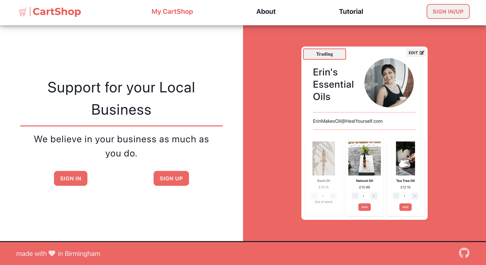
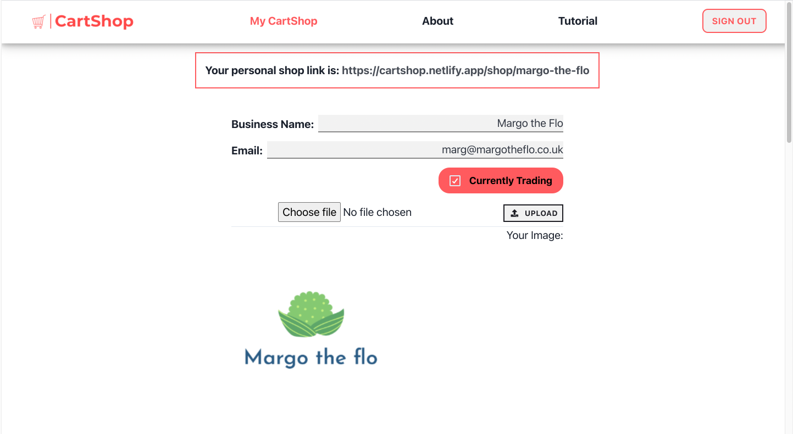

# CartShop

## Team Incredibles - School of Code Final Project
Completed in two weeks, in a remote team of five, using agile principles. 

## The Brief

This was our final project which we spent two weeks building for the School of Code Bootcamp.

Our brief was to address the impact the pandemic has had on small businesses. We were tasked with the problem on how we can help them get up and running as the economy opens up and to make up for lost time.

## [CartShop](https://cartshop.netlify.app/) 

More than ever, people do want to support local businesses but this has been difficult with Covid and the current restrictions in place. And it can be a daunting and costly task for small business owners to create a functional website. Cartshop was born as a solution to this. CartShop allows small business owners to easily gain online presence and sell their products to their customers.

With CartShop, business owners can set up their own page within minutes and easily offer their products for sale immediately. At sign up, each business is given a unique link to their business page which can then be shared with their customers. 

Customers are able to purchase products without the need to login or sign up to the page. 

An example page of what a customer might see, can be found [here](https://cartshop.netlify.app/shop/margo-the-flo).

## Product Views

### Landing Page

### Business Page
1. Form to update business details

2. Form to update product details and publish button

### Customer View
1. Landing page for customers

2. Customer basket view

3. Payment page

## The Stack

- React
- JavaScript & TypeScript
- Auth0
- StoryBook
- Stripe
- PostgreSQL
- ASP.NET & C#
- Chakra UI
- React Router
- Node.js
- Azure Blob Storage
- Jest & xUnit
- Trello
- Heroku & Netlify

## The Team

[Liam](https://github.com/LiamIsBuilding), [Christina](https://github.com/steen4reals), [Nathan](https://github.com/NathanHinks), [Sara](https://github.com/Sparkii77), [Rob](https://github.com/GandalfHod)
